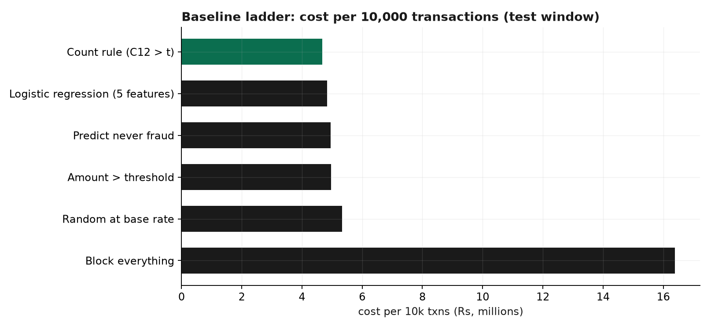
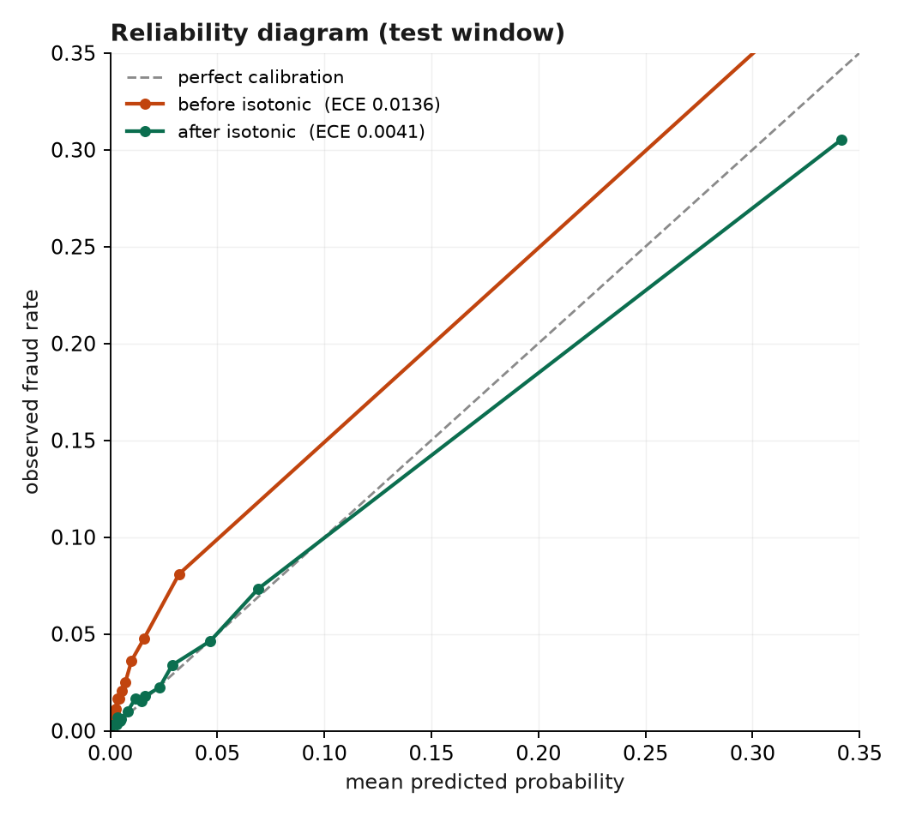
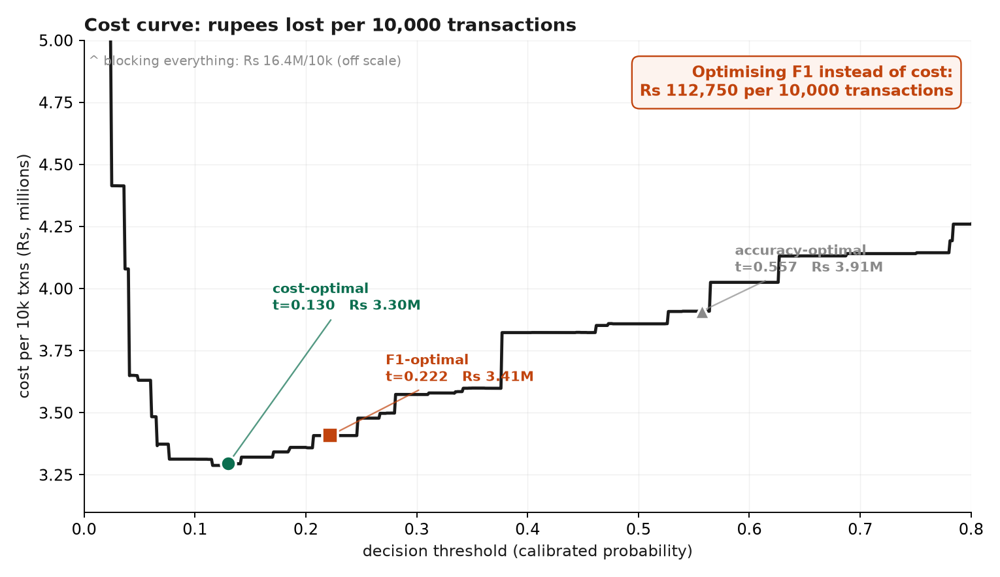
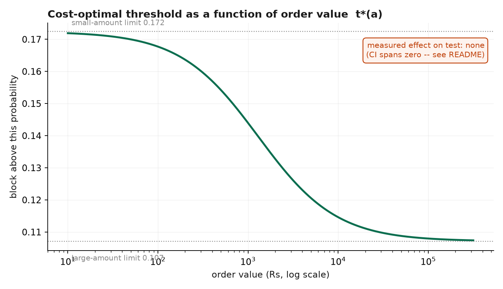
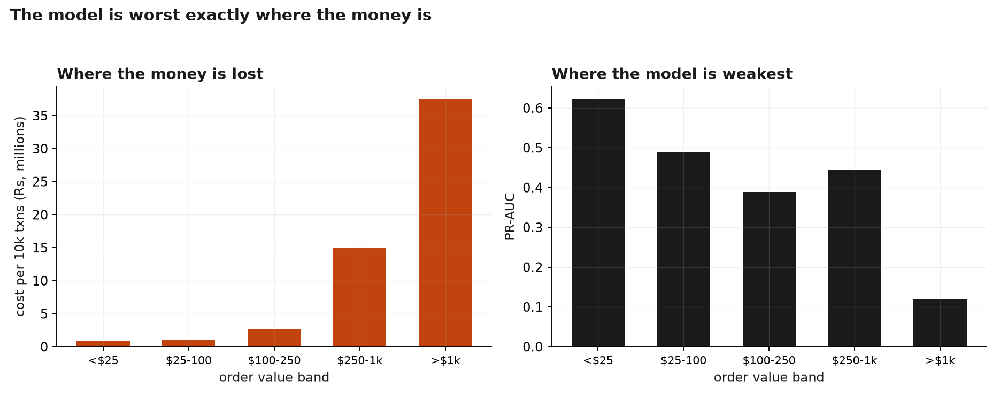

# Rupee-Optimal Risk

**A fraud decision engine that optimises money lost, not F1.**

Razorpay Buildathon — Track 2: AI Risk Manager

---

## Thesis

A fraud model's job is not to be accurate. It is to lose the merchant the least money — and those are different objectives with different optimal thresholds.

On a held-out, out-of-time test window of 118,108 real transactions, choosing the operating point by F1 instead of by rupee cost costs the merchant **₹112,750 per 10,000 transactions** (95% CI ₹34,904 – ₹200,873). Everything below exists to establish that number honestly, and to report the two places where our own ideas **failed**.

---

## Headline results

| Claim | Result | 95% CI | Verdict |
|---|---|---|---|
| Optimising F1 instead of cost | **₹112,750 / 10k txns** | ₹34,904 – ₹200,873 | **significant** |
| Model vs best simple baseline | **₹1,374,283 / 10k txns** | — | significant |
| Amount-dependent threshold `t*(a)` | −₹1,830 / 10k | −₹76,937 – +₹86,062 | **no effect** |
| Per-amount-band calibration | +₹214,710 / 10k (worse) | ₹66,366 – ₹345,741 | **worse on test** |

Two of the four are negative results, and both were ideas we proposed ourselves. They are reported here rather than deleted. See [What didn't work](#what-didnt-work).

---

## 1. The baseline ladder

Before any model, establish what "free" looks like. Every rung is scored on the same out-of-time test window, under the same protocol the model faces: threshold tuned on val-B, frozen, then applied to test.

| Baseline | Uses | PR-AUC | Precision | Recall | Block rate | **Cost / 10k txns** |
|---|---|---|---|---|---|---|
| Predict "never fraud" | nothing | — | 0.000 | 0.000 | 0.00% | ₹4,957,414 |
| Block everything | nothing | — | 0.034 | 1.000 | 100% | ₹16,391,839 |
| Random at base rate | nothing | 0.035 | 0.037 | 0.037 | 3.41% | ₹5,328,749 |
| Amount > threshold | one feature | 0.037 | 0.000 | 0.000 | 0.00% | ₹4,962,233 |
| **Count rule (C12 > 3)** | hand-written domain rule | 0.161 | 0.336 | 0.181 | 1.85% | **₹4,669,678** |
| Logistic regression | 5 features | 0.209 | 0.576 | 0.127 | 0.76% | ₹4,838,403 |
| **LightGBM (ours)** | full pipeline | **0.498** | 0.393 | 0.536 | 4.70% | **₹3,295,395** |

**Read the two bolded baselines against each other.** The one-feature count rule *loses* to logistic regression on PR-AUC (0.161 vs 0.209) and *beats* it on money (₹4.67M vs ₹4.84M per 10k). Because a missed fraud costs `amount + ₹1,200` while a false block costs `0.12 × amount + ₹250`, recall buys roughly eight times more than precision here. The ranking metric and the cash flow disagree, and they disagree before any model is involved.

**Novelty margin:** against a perfect oracle (zero cost), the best simple baseline leaves ₹4,669,678 of headroom per 10k. The model captures **29.4%** of it. Useful, not miraculous.

**Accuracy appears exactly once in this project** — the never-fraud row scores **96.5591%** accuracy on the test window (96.5010% across the full dataset) while catching zero fraud. That is why we do not use it.



---

## 2. Data provenance — stated plainly

| Layer | Source | What it is used for |
|---|---|---|
| Public | **IEEE-CIS Fraud Detection** (Vesta, 2019) — 590,540 transactions, 3.4990% fraud | **Every number in this README.** |
| Synthetic | *not built* | Cut for time. See [Limitations](#limitations). |

**No number here comes from synthetic data.** There is no live Razorpay integration and no simulated stream.

Three things IEEE-CIS does **not** contain, which materially shaped this project:

- **No merchant identifier.** Per-merchant thresholds — our original headline idea — are not computable. We segment by `ProductCD`, `card4`, `card6` and amount band instead.
- **No card / device / IP identifier.** True velocity features ("4 transactions on this card in 6 minutes") cannot be built. `card1` is a bank/BIN-like bucket with ~13,553 values over 590k rows, not a card. We use Vesta's own pre-computed `C1–C14` counting features and flag that the counting was done by the data provider, with masked definitions.
- **No payment-method or currency column.** There is no UPI-vs-cards analysis here, because the data cannot support one.

**Currency:** `TransactionAmt` is **USD**. We re-denominate at a single declared rate (₹88/USD) in [`costs.yaml`](costs.yaml). The *method* transfers to an Indian merchant unchanged; the absolute rupee figures are illustrative, not measured from Indian traffic.

**Identity coverage is 23.8%** — device, browser and OS features are absent for three quarters of rows. We leave them missing rather than imputing; the missingness is itself signal.

---

## 3. Evaluation protocol

**Temporal split, never random.** Fraud is non-stationary; a random split lets the model see the future.

| Split | Rows | Fraud rate | Days | Job |
|---|---|---|---|---|
| train | 354,324 | 3.383% | 1 – 101 | fit (early stopping on its own tail) |
| val-A | 59,054 | **4.318%** | 101 – 121 | calibration only |
| val-B | 59,054 | 3.490% | 121 – 141 | threshold selection only |
| test | 118,108 | 3.441% | 141 – 183 | read once |

**Each fold has exactly one job.** Fitting the calibrator and tuning the threshold on the same rows makes the threshold inherit the calibrator's overfit, so validation is split in two. Early stopping runs on the tail of *train*, not on val-A, so that val-A is not used for both model selection and calibration.

**Drift check:** the fraud rate is **4.32% in val-A** against 3.38% in train and 3.44% in test — a ~28% relative spike in the exact window used to calibrate. We did not move the fold to a friendlier window; choosing the calibration set by looking at test would defeat the purpose. It is a real production condition — you always calibrate on the past — and the ECE numbers below are what it produced.

**Thresholds are chosen on val-B and frozen.** Test is scored at the frozen threshold. Choosing the threshold on test and reporting the resulting test cost is an oracle number, and it is exactly the inflated claim this project exists to argue against. For transparency we report both:

| | Threshold | Cost / 10k |
|---|---|---|
| Frozen from val-B | 0.1300 | ₹3,295,395 |
| Test oracle (peeking) | 0.1200 | ₹3,287,939 |
| **Price of not seeing the future** | | **₹7,456** |

Fixed seed (42), frozen split indices in `data/splits.json`.

---

## 4. Model

**LightGBM, not deep learning.** On tabular fraud data GBDTs beat neural nets, train in minutes, and give exact tree SHAP for free. Reaching for a transformer here would be a red flag.

| Metric | Test (out-of-time) |
|---|---|
| **PR-AUC** | **0.4981** |
| ROC-AUC | 0.8825 *(for leaderboard comparison only)* |
| Recall @ 0.5% FPR | 0.3632 |
| Precision / recall at operating point (t=0.130) | 0.393 / 0.536 |
| Review rate | 5.00% |

We **pre-registered** an expected PR-AUC of 0.50–0.65 for a temporal split of this dataset, and set >0.75 as a leakage alarm to be investigated rather than celebrated. The result landed at 0.498, at the bottom of the range — consistent with having no UID-based velocity features, which is where the published top solutions get most of their lift.

**PR-AUC, not ROC-AUC.** At a 3.4% base rate ROC-AUC is dominated by the enormous negative class and stays flattering even when precision is unusable.

### No class weighting — and why the usual advice is wrong

The standard recommendation is to use `scale_pos_weight` *instead of* SMOTE, because resampling destroys probability calibration. The first half is right and the second half is a mistake: **reweighting shifts the predicted base rate too**, so it breaks calibration just as surely. Any prior-shifting technique needs recalibration afterwards.

Since the entire rupee argument depends on probabilities that mean what they say, we train **unweighted** and let isotonic regression do the work.

### Calibration

Isotonic regression fitted on val-A only.

| | ECE (test) |
|---|---|
| Before | 0.01360 |
| After | **0.00408** |



This is not decoration. Cost-optimal thresholding compares `p × c_FN(a)` against `(1−p) × c_FP(a)`. If a predicted 0.9 does not mean "90% likely fraud", every rupee figure in this README is built on sand.

---

## 5. The cost model

All assumptions live in [`costs.yaml`](costs.yaml), versioned, and the version is stamped into every audit-log row so any historical decision can be replayed against the cost model in force when it was made.

```
c_FN(a) = a + ₹1,000 chargeback fee + ₹200 ops        # fraud approved
c_FP(a) = 0.12·a + 0.05 × ₹3,000 LTV + ₹100 support   # legit customer blocked
```

The false-positive term uses **margin, not revenue**. Treating a blocked ₹10,000 order as a ₹10,000 loss overstates FP cost roughly eightfold and pushes the optimal threshold far too high.



| Operating point | Threshold | Precision | Recall | Block rate | Cost / 10k |
|---|---|---|---|---|---|
| **Cost-optimal** | 0.130 | 0.393 | 0.536 | 4.70% | **₹3,295,395** |
| F1-optimal | 0.222 | 0.499 | 0.475 | 3.28% | ₹3,408,145 |
| Accuracy-optimal | 0.557 | 0.783 | 0.327 | 1.44% | ₹3,908,968 |

> **Optimising F1 instead of cost would have cost this merchant ₹112,750 per 10,000 transactions** (95% CI ₹34,904 – ₹200,873, 1,000 bootstrap resamples of the test window).

Optimising *accuracy* would have cost ₹613,574 per 10k — and it looks the most impressive on a slide, at 78% precision.

---

## 6. What didn't work

Two ideas we proposed, built, measured, and are reporting as failures.

### Amount-dependent thresholds — no effect

Since `c_FN` scales with order value and `c_FP` scales with margin, no single threshold is theoretically optimal. The Bayes rule is per-transaction: block when `p > t*(a) = c_FP(a) / (c_FP(a) + c_FN(a))`.



**Measured effect on test: −₹1,830 / 10k, 95% CI [−₹76,937, +₹86,062]. The interval spans zero.**

Two reasons, both visible in the data. First, with these cost constants `t*(a)` only spans 0.107–0.172, and the global optimum (0.130) already sits inside that band. Second, and more interesting:



**The model is weakest exactly where the money is.** PR-AUC falls from 0.623 below $25 to 0.120 above $1k, while cost per 10k rises from ₹798k to ₹37.5M across the same bands. An amount-dependent threshold leans hardest on probabilities precisely where they are least trustworthy.

*(Note: the direction of `t*(a)` is not a law of fraud. It decreases with amount only when `fixed_fp > margin_rate × fixed_fn` — 250 > 144 here. Raise the flat chargeback fee enough and it reverses.)*

### Per-amount-band calibration — better on validation, worse on test

The diagnosis above suggests calibrating within amount bands. It looked like it worked:

| Configuration | val-B cost / 10k | test cost / 10k |
|---|---|---|
| Global calibration + global threshold | ₹3,221,039 | **₹3,295,395** |
| Global calibration + `t*(a)` | ₹3,225,012 | ₹3,297,224 |
| **Per-band calibration + global threshold** | **₹3,145,724** ← best on validation | ₹3,510,104 |
| Per-band calibration + `t*(a)` | ₹3,163,586 | ₹3,213,021 |

Selecting the configuration honestly — on val-B, before looking at test — picks per-band calibration. It **improved validation by ₹75,314 / 10k and degraded test by ₹214,710 / 10k** (95% CI ₹66,366 – ₹345,741).

Thin-band overfitting explains part of it: the >$1k band has only 36 fraud cases in val-A to fit an isotonic curve on. Excluding bands with fewer than 200 positives shrinks the damage to ₹67,191 / 10k with a CI spanning zero — no longer harmful, but still not a gain.

**We ship the simple configuration.** Had we selected on test, we would have shipped per-band + `t*(a)` and reported a ₹82,374 saving that our own validation protocol says we had no way to know about in advance.

---

## 7. Decision policy — three outcomes, bounded

```
score < 0.0652              →  AUTO-APPROVE
0.0652 ≤ score < 0.1852     →  MANUAL REVIEW   (5.00% of traffic, capped)
score ≥ 0.1852              →  AUTO-BLOCK
```

The review band straddles the cost-optimal cut and is widened until the 5% operational ceiling binds. It contains **9.31% fraud against a 3.44% base rate** — it is genuinely catching the ambiguous cases rather than padding the queue.

Review rate is a first-class metric. A system routing 30% of traffic to humans is unusable at any precision.

**Bounded actions.** The service never moves money. `BLOCK` and `REVIEW` are both reversible, every decision is appealable via `POST /v1/appeal/{id}`, and an appeal is recorded as labelled feedback — never as a deletion. Blast radius of a wrong call is one payment, recoverable.

---

## 8. Architecture

```
  txn ──▶ POST /v1/score  (FastAPI)
              ├─ feature frame  (training schema pinned from models/schema.pkl)
              ├─ LightGBM       (loaded once at startup)
              ├─ isotonic calibrator
              ├─ policy engine  (thresholds frozen from val-B)
              ├─ tree SHAP      → top-3 reason codes
              └─ audit logger   ──▶ SQLite (append-only)
              │
              └──▶ { decision, score, threshold_used, reason_codes,
                     merchant_message, model_version, cost_model_version,
                     degraded, latency_ms }

  GET  /v1/health          ← reports degraded mode honestly
  GET  /v1/audit/{id}      ← every decision ever recorded for a transaction
  POST /v1/appeal/{id}     ← overturn, logged as labelled feedback
```

**Latency** — 1,000 sequential requests replaying real test-window transactions, including SHAP reason codes and the audit write:

| p50 | p95 | p99 | max |
|---|---|---|---|
| 56.7 ms | **75.6 ms** | 89.7 ms | 213.3 ms |

Budget was p95 < 100 ms. **Met.**

**Graceful degradation.** If the model or the training schema fails to load, or scoring throws, the service falls back to the deterministic `C12 > 3` count rule and sets `degraded: true`. It does not fail open (approve everything — unbounded fraud) and it does not fail closed (block everything — which the cost model shows is ₹16.4M/10k, over 3× worse than doing nothing at all). The fallback rule was chosen by the baseline ladder and costs less per 10k than approving everything, so degraded mode is genuinely safe rather than a token gesture.

This path is **tested**, not asserted — `tests/test_service.py` removes the model file and verifies the service still returns correct `APPROVE`/`BLOCK` decisions and still audits them.

**Train/serve skew** is prevented by pinning the training schema (`models/schema.pkl`) — the exact 31 categorical dtypes and their category sets. Inferring dtypes from whatever the caller happens to send is precisely how a model behaves differently in production than in the notebook; LightGBM rejects the frame outright when the categorical set differs.

---

## 9. Explainability and audit trail

Every decision returns the top-3 SHAP contributors as reason codes. A real logged decision:

```
BLOCK  txn_3513412   ₹2,992   score 0.9000   actually_fraud=True
   - velocity/count signal (C1) elevated
   - aggregate risk feature (V258) elevated
   - time-since-previous-activity signal (D14) unusual
```

```
REVIEW  txn_3474693   ₹26,400   score 0.1159   actually_fraud=False
   - browser risk signal
   - transaction amount unusual for this profile
   - velocity/count signal (C13) elevated
```

The audit table stores transaction id, amount, score, threshold used, decision, reason codes, model version, **cost-model version**, degraded flag, latency, and any overturn.

**Merchant-facing vs internal explanations are deliberately different.** The customer sees *"Payment could not be completed. Please contact support to appeal."* The precise feature contributions stay internal — publishing the exact rule set teaches fraudsters what to avoid. This is asserted by a test.

---

## 10. Limitations

Stated plainly, because the rubric asks for honest metrics and because several of these are load-bearing.

1. **Cost constants are estimates, not measurements.** ₹1,000 chargeback fee, 12% margin, 5% churn, ₹3,000 LTV. Every headline number scales with them. They are in one versioned config file precisely so a merchant can substitute their own and re-run. The *method* is the contribution; the specific rupee figures are illustrative.
2. **US data re-denominated to INR.** IEEE-CIS is US e-commerce in USD at ₹88/USD. Indian payment traffic has a different amount distribution and a different method mix.
3. **No UPI, no payment methods, no merchants.** The dataset has no such columns. Anyone claiming UPI-specific fraud results from this dataset is fabricating them.
4. **Label definition is a known artifact.** Vesta labels a reported chargeback as fraud *and all subsequent transactions on the linked account* as fraud, with unreported fraud after 120 days labelled legit. So the labels partly encode a propagation rule, and true-but-unreported fraud sits in the negative class. Our recall is measured against reported chargebacks, not against fraud.
5. **Label delay makes the feedback loop slower than it looks.** Chargebacks arrive up to 120 days after the transaction. `POST /v1/appeal` exists, but nothing in production could evaluate a recent decision for months. Any "continuous retraining" story on this problem is overselling.
6. **No velocity features.** The single highest-signal family in real fraud detection is absent because the dataset has no entity identifiers. A production deployment at Razorpay would have real card and device IDs and should expect materially better results than 0.498 PR-AUC.
7. **Single model, single seed.** No ensembling, no hyperparameter search, no repeated-seed variance estimate. The bootstrap CIs capture test-window sampling noise only, not training variance.
8. **Calibration fold has a 4.3% base rate vs 3.4% in test.** A known, unfixed weakness — see §3.
9. **Cut for time:** synthetic Razorpay-shaped stream, live dashboard, `/v1/metrics`, ULB extreme-imbalance appendix. The cost model and the baseline ladder were protected instead, as the differentiators.

---

## Reproducing

```bash
uv venv --python 3.11 .venv
uv pip install --python .venv/bin/python -r requirements.txt
brew install libomp                       # LightGBM needs OpenMP on macOS

echo "KAGGLE_API_TOKEN=<your token>" > .env
# accept the competition rules at kaggle.com/competitions/ieee-fraud-detection/rules
kaggle competitions download -c ieee-fraud-detection -f train_transaction.csv -p data/
kaggle competitions download -c ieee-fraud-detection -f train_identity.csv   -p data/
( cd data && unzip -o '*.zip' && rm *.zip )

.venv/bin/python -m src.data              # load, temporal split, drift check
.venv/bin/python run_baselines.py         # the ladder
.venv/bin/python run_model.py             # train, calibrate, cost curve, segments
.venv/bin/python build_schema.py          # pin the serving schema
.venv/bin/python run_band_calibration.py  # the per-band diagnosis
.venv/bin/python run_configuration_choice.py  # honest configuration selection
.venv/bin/python run_figures.py           # figures
.venv/bin/python run_demo.py              # replay + latency benchmark
.venv/bin/python -m pytest tests/ -q      # 22 tests, incl. degraded mode
```

Serve it:

```bash
.venv/bin/uvicorn src.service:app --port 8000
curl -s localhost:8000/v1/health
```

## Layout

| Path | What |
|---|---|
| [`costs.yaml`](costs.yaml) | Every rupee assumption, versioned |
| [`src/costs.py`](src/costs.py) | Cost model, threshold sweep, bootstrap CIs |
| [`src/data.py`](src/data.py) | Loading, temporal splits, leakage assertions |
| [`src/baselines.py`](src/baselines.py) | The ladder |
| [`src/model.py`](src/model.py) | LightGBM + isotonic, fold discipline |
| [`src/evaluate.py`](src/evaluate.py) | PR-AUC, ECE, reliability, recall@FPR |
| [`src/service.py`](src/service.py) | FastAPI, audit log, fallback rule |
| [`tests/`](tests/) | 22 tests — money math and degraded mode |
| [`reports/`](reports/) | All generated tables and figures |
